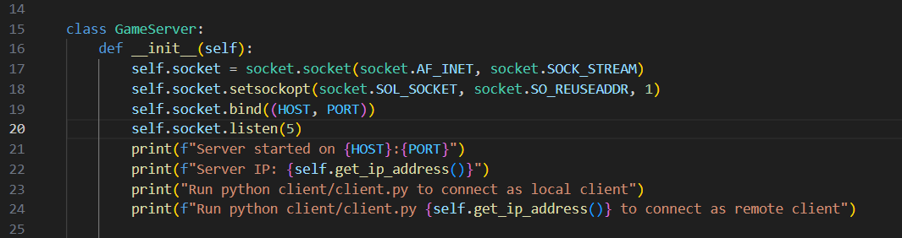
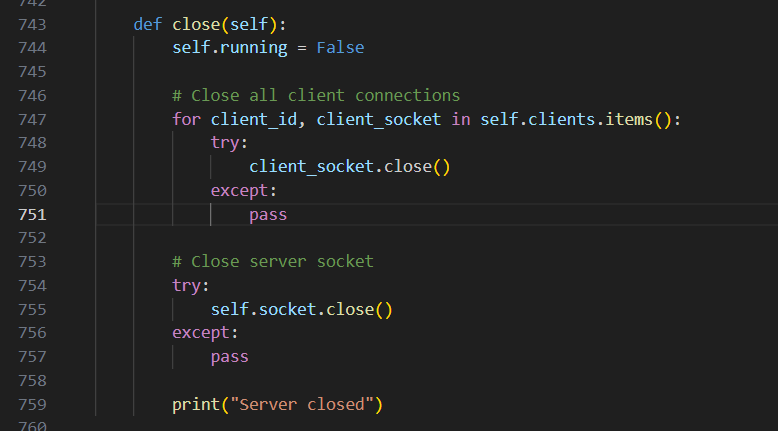
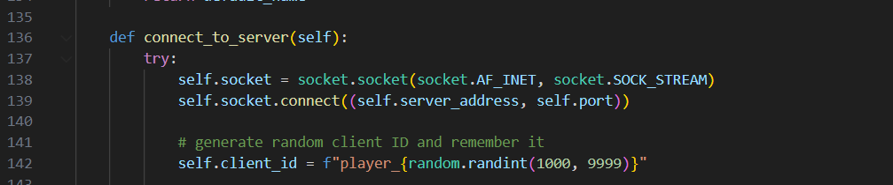
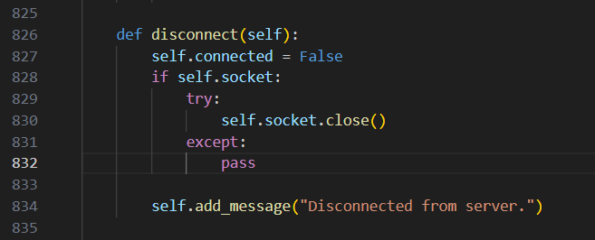
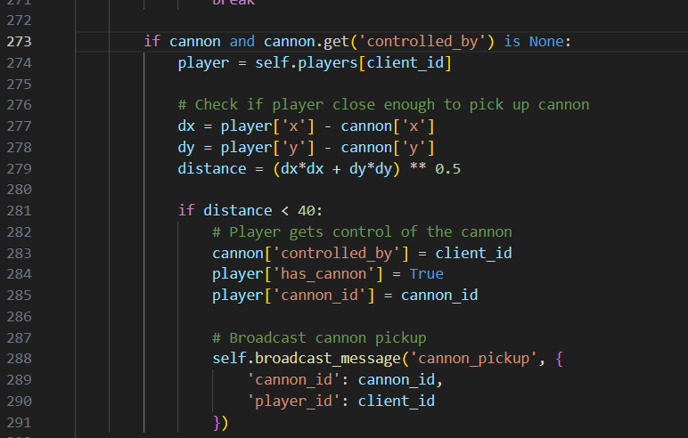

<h4 align="center">
    Cannon Chaos <br>
    CMPT 371: Data Communication / Networking
    <div align="center">
    <br>
        <!-- <a href=".">
            
        </a> -->
    </div>
</h4>

<p align="center">
    <a href="#team-member">Team member</a> •
    <a href="#framework">Framework</a> •
    <a href="#gameplay-mechanics">Game Mechanics</a> •
    <a href="#technical-details">Technical details</a> •
    <a href="#setting-up">setup</a> •
    <a href="#contribution">Contribution</a>
</p>

## Gameplay
[Game Demo](https://www.youtube.com/watch?v=Xbpw8sn5k-k)

### Team member

- Tommy Oh (301544525)
- Alex Chung (301549726)
- Parmveer Singh Nijjar (301563903)
- Munir Adam (301568875)

### Framework

- This project is based on Python
- We are using the pygame interface for our frontend

## Overview  
**Cannon Chaos** is a **real-time online multiplayer game** where players compete in a grid-based arena, racing to control powerful cannons and eliminate opponents. The last player standing wins.  

The game follows a **client-server architecture**, where one player hosts the server, and all others connect as clients. Networking is implemented using **raw socket programming**, ensuring direct communication between players.  

## Gameplay Mechanics  

- The game takes place on a **square grid-based arena** with obstacles providing cover.  
- **A cannon spawns randomly** on the map, and players must race to reach them.  
- The first player to **reach the cannon gains exclusive control** (mutex lock).  
- Cannons have a **timed duration of use**—if the player doesn't fire within the time limit, they **explode**.  
- Each cannon has a **limited number of shots** before becoming inactive.  

### 🔥 Cannon Types  
- **Rapid Shot** – Fires fast but deals low damage.  
- **Explosive Shell** – Slow but has a large explosion radius.  
- **Bouncing Shot** – Ricochets off walls, hitting unexpected angles.  

### 🎯 Power-ups    
- **Speed boost** allows quick movement (short cooldown).  
- **Health boost** adds extra HP.   

### ⚡ Game Flow Enhancements  
- **Power-ups** drop when a player is eliminated (e.g., speed boost, health pack).  
- **Sudden Death Mode** activates if the match lasts too long (one-shot kill).  

## Winning Condition
- **Health bar** decreases when hit; players are eliminated when it reaches zero.  
- The **last player alive wins**.  

## Technical Details  

- **Client-Server Model**  
  - One player starts the **server**, and all players (including the host) connect as **clients**.  
- **No External Game Networking Libraries**  
  - The backend is written using **raw socket programming** for player movement, cannon control, and game state synchronization.  
- **Simple 2D Graphics**  
  - The game uses **Pygame** for rendering, focusing on functionality over complexity.  

## Setting up 
### Prerequisites  
- Python 3.x  
- Pygame  

### Running the Game  

It is recommanded to use virtual environment.

```sh
// How to make virtual environment
python3 -m venv .venv

// Use the shell script to activate virtual environment
source activate_venv.sh

// Install dependency (we only used pygame)
pip install -r requirements.txt 

// or only pygame
pip install pygame

// Run the server
python server/server.py

// Join the game local client
python client/client.py

// Join the game as remote client
python client/client.py <ip>

```

The project is developed by a **4-person team**, with each member focusing on a specific aspect of the game.  

### Contribution

**Every group member** handle client-server communication between all game components (ex. sychronizing player movement, cannon projectiles, etc)

#### <u>Specific work done by each group member</u>


- Alex (25%)
  - implemented initial player movement and cannon shooting functionality
  - implemented nickname functionality
  - implement text_input.py
  - code-cleanup


- Tommy (25%)
  - set up basic structure of client-server system and socket
  - refactored the code (cannon.py, obstacle.py,..., etc)
  - implemented basic structure of nickname functionality


- Parmveer (25%)
  -  implemented sudden death (added the logic where u can one-shot players during sudden death)
  -  implemented speed boost and HP powerups
  -  implemented ping (to track lag/latency)
  -  implemented server timeout (so the server doesnt stay running forever after everyone disconnects)
  -  code-cleanup


- Munir (25%):
  - implemented projectile shooting physics
  - smoothen and restrict player movement
  - game background and player design
  - code clean up

## Code Snippets
Includes socket opening/closing and handling of mutex-locked object (cannon).





